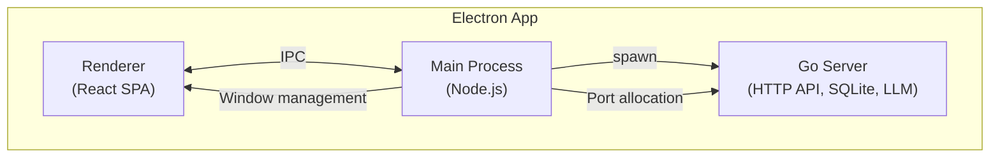

<div align="center">
  
  <h1>Private Buddy</h1>
</div>

A modern, private AI assistant system built from scratch. I initially called this project "Boring Practice" because it was just a practice project - I once just wanted to build a modern agent system from zero to show I know how to do it. However, as development and iteration continued, I thought perhaps I could try to make it a low-barrier application: no complex deployment, users can start using it right after downloading and installing. Additionally, I found something interesting — as an engineer without a background in cognitive science, psychology, or narratology, I discovered that through AI one can quickly judge whether certain theories have practical positive significance for the current business or engineering, and then apply them cross-disciplinarily, which was truly hard to imagine before.

---

## What It Does

You can:
- Create multiple AI agents with different prompts
- Chat with them and keep history
- Delegate tasks to agents for real-world execution

More features will be added gradually.

## Quick Start

### Prerequisites

- Go 1.26 or higher
- Node.js 18 or higher
- LLM API key

### Option A: Desktop Application (Recommended)

Download the latest release for your platform from the [Releases](https://github.com/KoanJan/private-buddy/releases) page.

Or build from source:

```bash
# Clone the repository
git clone https://github.com/KoanJan/private-buddy.git
cd private-buddy

# Install dependencies
npm install

# Build for your platform
npm run dist:mac    # macOS (DMG + ZIP)
npm run dist:win    # Windows (NSIS installer)
npm run dist:linux  # Linux (AppImage + DEB)
```

The built packages will be in `dist-electron/<platform>/`.

### Option B: Development Mode

#### 1. Clone the Repository

```bash
git clone https://github.com/KoanJan/private-buddy.git
cd private-buddy
```

#### 2. Setup Server

```bash
cd server

# Configure environment variables (optional)
cp .env.example .env

# Start server (builds and runs Go binary)
./start.sh
```

The server runs on `http://localhost:8000` by default.

#### 3. Setup Web

```bash
cd web

# Install dependencies
npm install

# Start development server
npm run dev
```

#### 4. Access the Application

- **Web UI**: http://localhost:5173

### Option C: Electron Development

Run the Electron app in development mode (requires two terminals):

**Terminal 1 - Start Vite dev server:**
```bash
npm run dev:web
```

**Terminal 2 - Build backend and run Electron:**
```bash
# Build Go backend (required before first run or after server code changes)
npm run build:server

# Start Electron app
npm run dev
```

This will:
1. Compile Electron main process
2. Start the Go backend server
3. Load the web frontend from Vite dev server (hot reload enabled)
4. Open the desktop application window

## Service Management

Both server and web services include management scripts:

```bash
# Start service
./start.sh

# Stop service
./stop.sh

# Restart service
./restart.sh
```

## Architecture



## Tech Stack

| Layer | Technology |
|-------|------------|
| Frontend | React + TypeScript + Vite + Ant Design |
| Desktop | Electron |
| Backend | Go + Gin + GORM |
| Database | SQLite (pure Go driver) |
| LLM | OpenAI API compatible |

## License

This project is licensed under the GPLv3 License - see the [LICENSE](LICENSE) file for details.
